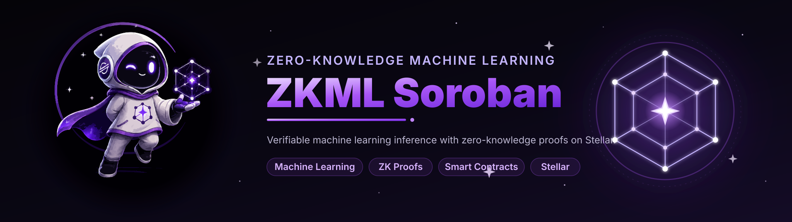
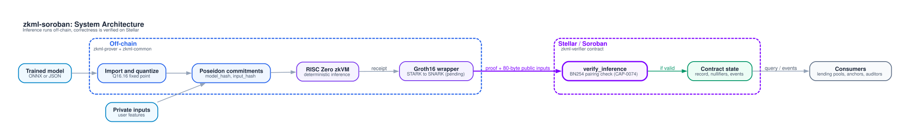

<p align="center">
  
</p>

<h3 align="center">Provable machine learning inference, verified on Stellar</h3>

<p align="center">
  <a href="https://github.com/ZKML-Soroban/ZKML-Soroban/actions/workflows/ci.yml"></a>
  <a href="https://crates.io/crates/zkml-common"></a>
  <a href="https://crates.io/crates/zkml-verifier"></a>
  <a href="LICENSE"></a>
  
</p>

---

**zkml-soroban** runs small machine learning models off-chain and proves, with zero-knowledge
cryptography, that a specific model produced a specific result on specific inputs. A Soroban
smart contract verifies that proof on Stellar and records the outcome, without revealing the
model weights or the input data.

It is built on the zero-knowledge primitives of Stellar Protocol 25 (X-Ray):
BN254 elliptic curve operations ([CAP-0074](https://github.com/stellar/stellar-protocol/blob/master/core/cap-0074.md))
and Poseidon hashing ([CAP-0075](https://github.com/stellar/stellar-protocol/blob/master/core/cap-0075.md)).

## Why

Credit scoring, KYC risk tiers and compliance checks are increasingly decided by ML models, yet
counterparties cannot check that a claimed result really came from the approved model.
zkml-soroban turns that claim into something any Stellar contract or auditor can verify in a
single on-chain call.

## How it works

<p align="center">
  
</p>

1. A trained model is imported from ONNX and quantized to deterministic fixed-point arithmetic.
2. The model and the inputs are bound with Poseidon commitments.
3. Inference runs inside the RISC Zero zkVM, producing a proof of correct execution.
4. The proof is compressed to Groth16 and submitted to the verifier contract.
5. The contract runs the BN254 pairing check, rejects replays and emits a `verified` event.

> **Status:** steps 1 to 3 and step 5 are implemented. Groth16 compression (step 4) and reading
> ONNX directly from the CLI are pending, so no production proof has been verified on-chain yet.

## Supported models

| Model | Import | Inference | Decision output |
| ----- | ------ | --------- | --------------- |
| Decision tree | ONNX `TreeEnsembleClassifier`, JSON | yes | leaf value |
| Logistic regression | ONNX `LinearClassifier`, JSON | yes | threshold class |
| Tiny MLP (ReLU) | ONNX `Gemm` / `MatMul` + `Relu`, JSON | yes | argmax class |

## Crates

| Crate | Description | Published |
| ----- | ----------- | --------- |
| [`zkml-common`](crates/zkml-common) | Fixed-point math, models, inference, Poseidon commitments. Core crate of the zkVM guest. | crates.io (from 0.0.1) |
| [`zkml-verifier`](crates/zkml-verifier) | Soroban contract: Groth16 verification, admin, pause, replay protection. | crates.io (from 0.0.1) |
| [`zkml-prover`](crates/zkml-prover) | ONNX import, quantization, CLI, zkVM proving. | not yet |
| [`zkml-demo`](crates/zkml-demo) | End-to-end demo runner (in progress). | no |
| [`methods`](methods) | RISC Zero guest program. | no |

## Quick start

Requirements: Rust 1.91+ (stable). Optional: the [RISC Zero toolchain](https://dev.risczero.com/api/zkvm/install)
for zkVM proving and the [Stellar CLI](https://developers.stellar.org/docs/tools/cli) for deployment.

```bash
git clone https://github.com/ZKML-Soroban/ZKML-Soroban.git
cd ZKML-Soroban

cargo test --workspace

# Commit to a model and run inference with the prover CLI
cargo run -p zkml-prover -- commit examples/models/credit_lr.json
cargo run -p zkml-prover -- infer examples/models/credit_lr.json -i 0.5,0.2,0.1,0.9

# Build the verifier contract
cargo build -p zkml-verifier --target wasm32v1-none --profile contract
```

Common tasks are also available through [`just`](justfile): `just test`, `just contract`,
`just zkvm`, `just package`, `just docs`.

## Project status

zkml-soroban is pre-1.0 and under active development.

| Area | Status |
| ---- | ------ |
| Fixed-point core, inference, ONNX import | Done |
| Poseidon commitments, Merkle proofs | Done |
| zkVM guest execution (STARK receipt) | Done (dev mode in CI) |
| On-chain Groth16 verification, admin, replay protection | Done |
| STARK to Groth16 compression, verification key export | Pending |
| Testnet end-to-end KYC demo | In progress |
| Native BN254 circuits (Phase 2) | Planned |

Full plan: [roadmap](docs/project/roadmap.md). Known gaps: [known limitations](docs/security/known-limitations.md).

## Documentation

The [`docs/`](docs) folder is a [Mintlify](https://mintlify.com) site. Preview it locally with
`cd docs && npx mint dev`.

- [Architecture](docs/concepts/architecture.md)
- [Verifier contract reference](docs/reference/verifier-contract.md)
- [Prover CLI](docs/guides/cli.md)
- [Threat model](docs/security/threat-model.md)

## Repository layout

```
.
├── crates/
│   ├── zkml-common/     shared deterministic core (publishable)
│   ├── zkml-verifier/   Soroban verifier contract (publishable)
│   ├── zkml-prover/     off-chain prover library and CLI
│   └── zkml-demo/       end-to-end demo runner
├── methods/             RISC Zero guest program
├── examples/            example models and the KYC demo
├── diagrams/            Graphviz diagram sources (rendered into docs/diagrams)
├── docs/                Mintlify documentation site
├── assets/              logo and banner
└── .github/             CI, crate publishing, templates
```

## Releases

All publishable crates share the workspace version. Bumping `workspace.package.version` in
`Cargo.toml` and merging to `main` publishes the new version to crates.io and creates the
matching `vX.Y.Z` GitHub Release (see [`publish-crate.yml`](.github/workflows/publish-crate.yml)).

## Contributing

Contributions are welcome. Read [CONTRIBUTING.md](CONTRIBUTING.md) and the [Code of Conduct](CODE_OF_CONDUCT.md) first. Report security issues
privately as described in [SECURITY.md](SECURITY.md).

## License

Licensed under the [Apache License 2.0](LICENSE).

## Acknowledgments

- [Stellar Development Foundation](https://stellar.org) for the Protocol 25 zero-knowledge host functions.
- [RISC Zero](https://risczero.com) for the zkVM.
- [Nethermind](https://nethermind.io) for prior work on verifying RISC Zero proofs on Soroban.
