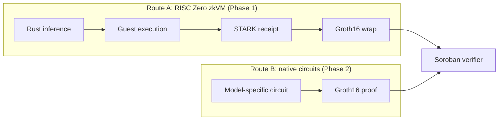
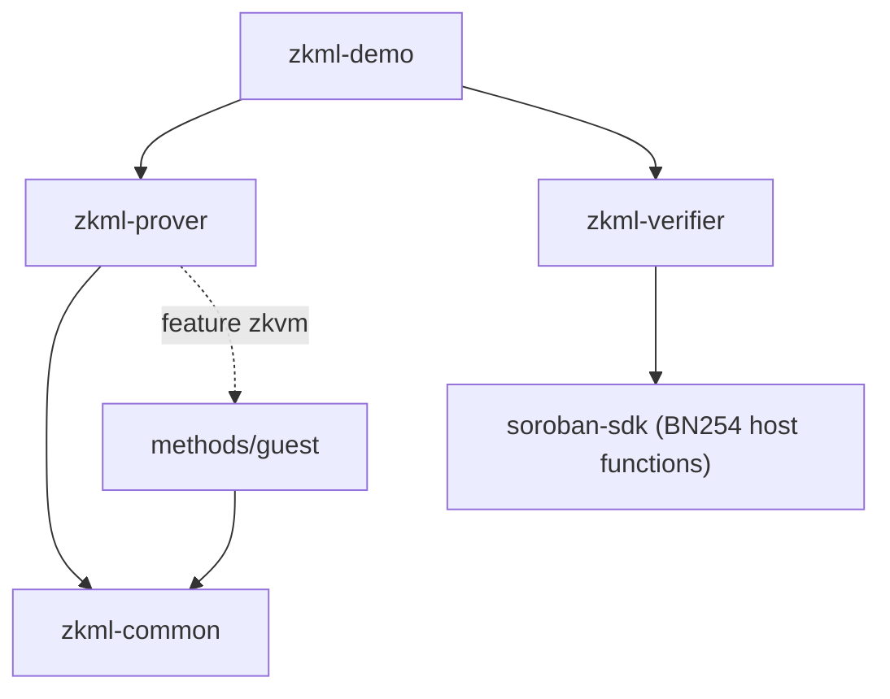

zkml-soroban follows an off-chain prover / on-chain verifier pattern. All
expensive work (model import, quantization, inference, proving) happens
off-chain. The Soroban contract performs one Groth16 pairing check per
verification and records the result.

## Design principles

1. **Separation of proving and verification.** Inference and proof generation
   run off-chain; the contract performs a single cryptographic check.
2. **One inference engine.** The inference code lives in `zkml-common` and is
   shared by the native prover and the RISC Zero guest, so the proven path and
   the tested path cannot drift.
3. **Fixed-point arithmetic everywhere.** Parameters and inputs are quantized to
   Q16.16 at import time. Inference is deterministic integer math.
4. **Minimal on-chain footprint.** The contract stores configuration, the last
   verified record, a counter, and one nullifier per accepted proof. Proof
   bytes are never persisted.

## High-level view

<Frame>
  
</Frame>

## Crates

| Crate / path          | Role                                                                 |
| --------------------- | -------------------------------------------------------------------- |
| `crates/zkml-common`  | Shared library: fixed-point math, models, inference, Poseidon commitments, Merkle tree, proof types. |
| `crates/zkml-prover`  | Off-chain host: ONNX and JSON import, quantization validation, CLI, zkVM receipt generation, bundle serialization. |
| `crates/zkml-verifier`| Soroban contract (WASM): Groth16 verification over BN254, admin, pause, nullifiers, TTL, events. |
| `crates/zkml-demo`    | End-to-end demo runner (skeleton, pending).                          |
| `methods/`, `methods/guest` | RISC Zero method build and guest program (separate workspace). |

`zkml-common` has no dependency on the Soroban SDK or RISC Zero, so it compiles
for the host and the zkVM guest. Its `std` feature can be disabled for the guest; a fully
`no_std` build is not supported yet because of transitive dependencies.

### zkml-common

| Module         | Responsibility                                                    |
| -------------- | ----------------------------------------------------------------- |
| `fixed_point`  | Q16.16 `FixedPoint` with checked, saturating, and operator arithmetic |
| `activation`   | ReLU, leaky ReLU, ReLU6, hard sigmoid, hard swish, hardtanh        |
| `models`       | `DecisionTree`, `LogisticRegression`, `TinyMLP`, `Model`, validation |
| `inference`    | `run_inference`, `try_run_inference`, `run_inference_with_decision`, batch helpers |
| `commitment`   | Poseidon commitments over BN254 Fr, model element flattening       |
| `merkle`       | Domain-separated Merkle tree with inclusion proofs                 |
| `proof`        | `Groth16Proof`, `PublicInputs`, `VerificationBundle`               |

### zkml-prover

| Module          | Responsibility                                                  |
| --------------- | --------------------------------------------------------------- |
| `onnx`          | Protobuf decode, per-domain opset checks, extraction of trees, linear classifiers, and MLPs |
| `model_io`      | JSON exchange format import                                     |
| `quantization`  | Range checks, static overflow bounds, accuracy report           |
| `prover`        | Commitments, `generate_receipt` (feature `zkvm`), bundle assembly and JSON |
| `cli`           | `commit`, `infer`, `prove`, `validate`, `inspect` subcommands   |

### zkml-verifier

See the [verifier contract reference](/reference/verifier-contract) for the full
interface. In short: `initialize` stores the admin, model commitment, and
verification key; `verify_inference` runs the pairing check, enforces the
nullifier, records an `InferenceRecord`, and emits a `verified` event.

## Data flow

<Frame>
  
</Frame>

1. **Model preparation (one time).** Export a trained model to ONNX or JSON,
   import it, quantize it, and compute its Poseidon commitment
   (`zkml-prover commit`). Register it on-chain with `initialize`.
2. **Proving.** The host writes the model and inputs to the zkVM guest. The
   guest runs the shared inference engine and commits
   `(model_hash, input_hash, output, class_label)` to the journal. The host
   verifies the receipt and cross-checks the journal against native inference.
3. **Verification.** The proof and the 80-byte public inputs are submitted to
   `verify_inference`, which verifies the Groth16 equation using BN254 host
   functions.
4. **Consumption.** Indexers follow the `verified` event; clients read
   `get_result`.

## On-chain verification flow

<Frame>
  
</Frame>

## Route A and Route B

**Route A (Phase 1).** Inference is ordinary Rust running in the RISC Zero
zkVM. Any Rust code can be proven and the proving stack is mature; the cost is
zkVM overhead in proving time. The STARK receipt must be wrapped into Groth16
for Soroban. Guest execution and receipts work today; the Groth16 wrap is
pending.

**Route B (Phase 2).** Model-specific BN254 circuits (decision tree traversal,
linear algebra, dense layers with ReLU) produce Groth16 proofs directly, with
fewer constraints and smaller verification keys. Requires writing and auditing
circuits per model family.

> **Note.** The current contract treats
> `(model_hash, input_hash, output, class_label)` as the Groth16 public inputs.
> That layout fits Route B directly. A RISC Zero Groth16 proof exposes different
> public inputs, so Route A needs an adapted verifier. See
> [Known limitations](/security/known-limitations).

## Dependency graph

## Security considerations

- **Proof soundness** relies on Groth16 over BN254.
- **Model binding.** The `model_hash` public input must equal the stored
  commitment; changing a model requires the admin to update it.
- **Input binding.** The input commitment is part of the public inputs and the
  nullifier.
- **Access control.** `initialize` requires the admin signature and can run once;
  `set_verification_key`, `set_model_hash`, `set_admin`, and `set_pause` require
  the current admin.
- **Overflow.** Fixed-point multiplication uses `i128` intermediates with checked
  results; the quantization validator runs static overflow bounds.
