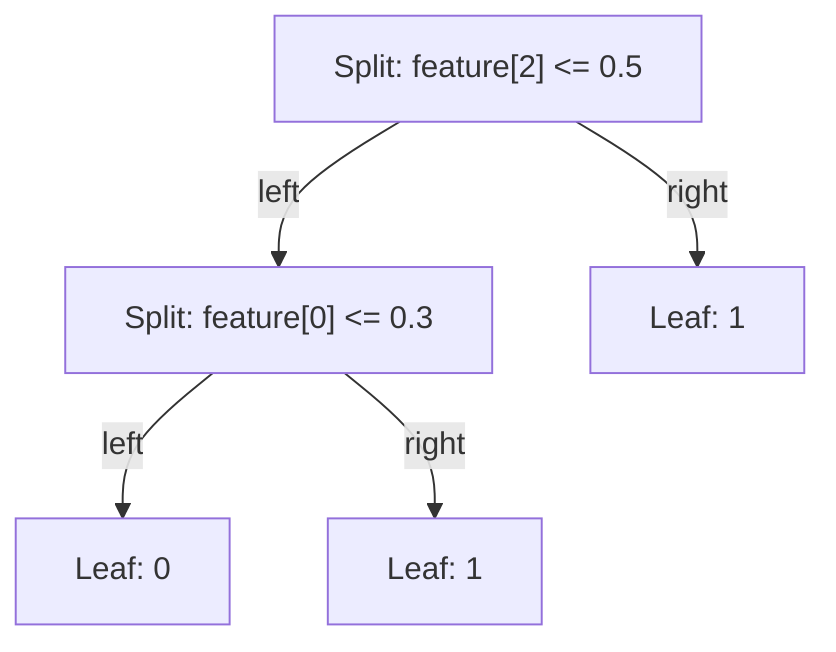

## ZK primitives on Stellar

### BN254 (CAP-0074)

BN254 (alt-bn128) is a pairing-friendly curve used by most deployed zk-SNARKs.
Protocol 25 (X-Ray) added Soroban host functions for G1 addition, G1 scalar
multiplication, and multi-pairing checks. They run natively in Stellar Core
rather than in WASM, which is what makes on-chain Groth16 verification
affordable. BN254 provides roughly 100 to 128 bits of security depending on the
estimate used; it is the same curve as Ethereum's precompiles.

### Poseidon (CAP-0075)

Poseidon is an algebraic hash designed for cheap evaluation inside circuits.
zkml-soroban uses it for:

1. **Model commitment:** a hash of all quantized parameters, registered on-chain.
2. **Input commitment:** a hash of the quantized input features, carried in the
   public inputs.

Off-chain commitments are computed with `light-poseidon` using circomlib
parameters over BN254 Fr. The contract compares commitments byte for byte; it
does not recompute Poseidon on-chain. See [Commitments](/concepts/commitments).

### Groth16

- **Constant size:** three curve points, A and C in G1 (64 bytes each,
  uncompressed) and B in G2 (128 bytes), 256 bytes total in the contract's
  encoding.
- **Constant verification:** one multi-scalar sum over the public inputs and one
  4-pair pairing check.
- **Trusted setup:** circuit-specific. For Route A it is provided by RISC Zero's
  universal Groth16 wrapper; Route B needs a setup per circuit.

Verification equation:

```text
e(A, B) = e(alpha, beta) * e(L, gamma) * e(C, delta)
L = IC[0] + sum_i ( x_i * IC[i + 1] )
```

The contract evaluates it as
`e(-A, B) * e(alpha, beta) * e(L, gamma) * e(C, delta) == 1`.

## Protocol context

- **Protocol 25 (X-Ray)**, January 2026: BN254 and Poseidon host functions.
  Minimum protocol version for the verifier (`MIN_PROTOCOL_VERSION = 25`).
- **Protocol 26 (Yardstick)**: benchmarking tooling useful to measure
  verification cost; not required.

## Fixed-point arithmetic

Values are stored as `i64` scaled by `2^16` (Q16.16), about 4 to 5 decimal
digits of fractional precision and a range of roughly +/- 1.4e14.
Multiplication widens to `i128` before the shift. See
[Fixed-point arithmetic](/concepts/fixed-point).

## Quantization strategy

1. **Extraction:** parse ONNX (or JSON) into internal model types.
2. **Uniform quantization:** multiply by `2^16`, round to nearest.
3. **Validation** (`zkml-prover validate`): range check, static overflow bounds
   for a bounded input magnitude, and optional accuracy agreement against
   recorded float outputs.
4. **Commitment:** Poseidon over the quantized parameters.

### Supported ONNX operators

| Operator                 | Target model         | Notes                                   |
| ------------------------ | -------------------- | --------------------------------------- |
| `TreeEnsembleClassifier` | `DecisionTree`       | Single tree only, `BRANCH_LEQ` nodes    |
| `LinearClassifier`       | `LogisticRegression` | Binary only                             |
| `Gemm`                   | `TinyMLP`            | Fused dense layer                       |
| `MatMul` + `Add`         | `TinyMLP`            | Two-node dense layer                    |
| `Relu`                   | `TinyMLP`            | Between hidden layers                   |

Opset floors: core `>= 17`, `ai.onnx.ml >= 1`. See [ONNX import](/guides/onnx-import).

## Prover stack

### Phase 1: RISC Zero zkVM

1. `methods/guest` is compiled for the RISC Zero target with
   `risc0-build =3.0.6`.
2. The host writes the `Model` and `Vec<FixedPoint>` into the executor
   environment.
3. The guest runs `run_inference_with_decision`, computes the commitments, and
   commits the journal.
4. The zkVM produces a STARK receipt; the host verifies it against the image ID
   and cross-checks the journal against native inference.
5. The receipt is compressed to Groth16 (feature `groth16`), which runs
   locally and needs x86_64 Linux with Docker. The result is a 260-byte seal
   packaged as a [v2 bundle](/reference/bundle-format). Remote proving is not
   implemented: Bonsai was shut down in December 2025, so `--backend boundless`
   is a placeholder for Boundless or a self-hosted Bento prover.
6. The contract's `verify_receipt` reconstructs the receipt claim digest from
   the journal with the host's SHA-256 and runs the pairing check against RISC
   Zero's universal verifying key. A real receipt verifies this way in the
   Soroban test environment; it has not yet been exercised on a live network.

CI runs the guest with `RISC0_DEV_MODE=1`.

### Phase 2: native circuits

Decision tree circuit sketch:



- The prover supplies a binary selector per split as witness.
- Constraints enforce that each selector matches the comparison.
- A path constraint selects exactly one leaf; the output equals its value.

Logistic regression is a small number of multiplication and addition gates.
MLP ReLU is a comparison gadget plus conditional selection.

## Verifier contract design

- **Canonical inputs:** exactly 80 bytes of public inputs, strict lengths.
- **Replay protection:** SHA-256 nullifier over the public inputs, persistent
  storage.
- **Admin controls:** key rotation, model hash update, admin transfer, pause.
- **Liveness:** instance TTL bump on `initialize` and successful verification.
- **Observability:** `verified` event with `model_hash` topic.

Future work: multi-model registry, per-subject records, batch verification.

## Benchmark targets

| Metric                  | Phase 1 target | Phase 2 target | Current                   |
| ----------------------- | -------------- | -------------- | ------------------------- |
| Proof generation time   | Under 30 s         | Under 5 s          | About 20 min on a laptop CPU (see benchmarks) |
| Proof size              | Under 500 bytes    | Under 200 bytes    | 260-byte seal (4-byte selector + 256-byte proof) |
| On-chain verification   | Measured       | 50% of Phase 1 | 29.6M CPU instructions for a receipt, measured on the WASM |
| End-to-end latency      | Under 60 s         | Under 15 s         | Not measured              |

See [Benchmarks](/reference/benchmarks).
