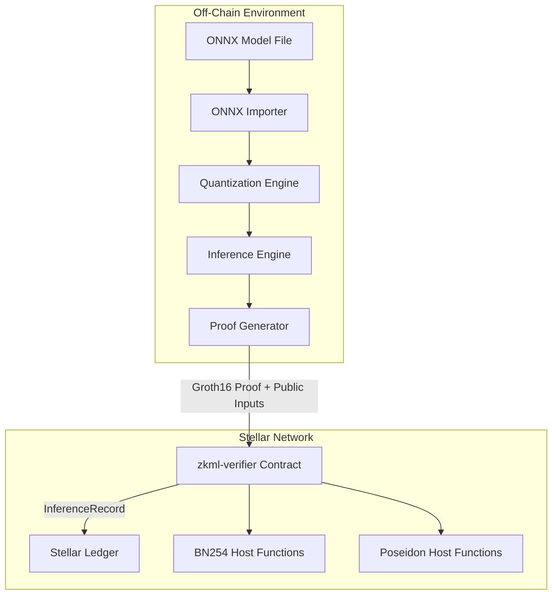
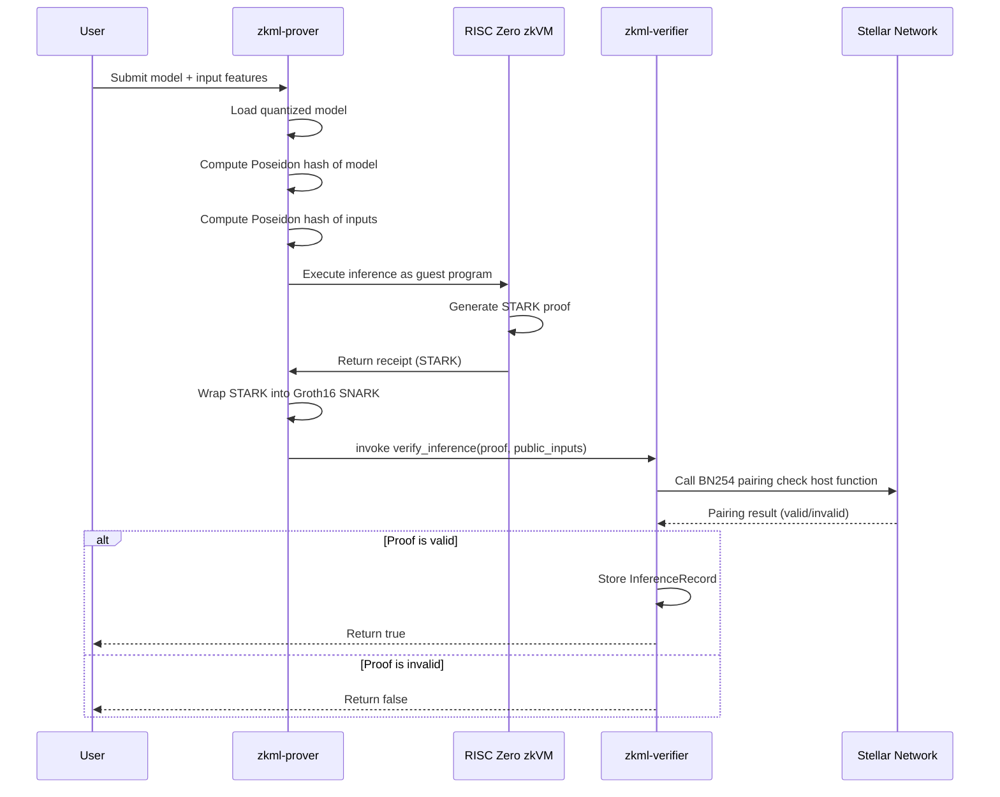
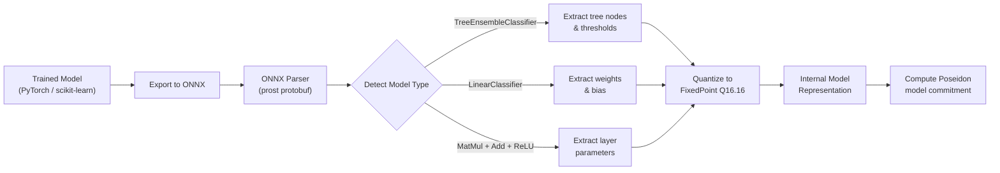
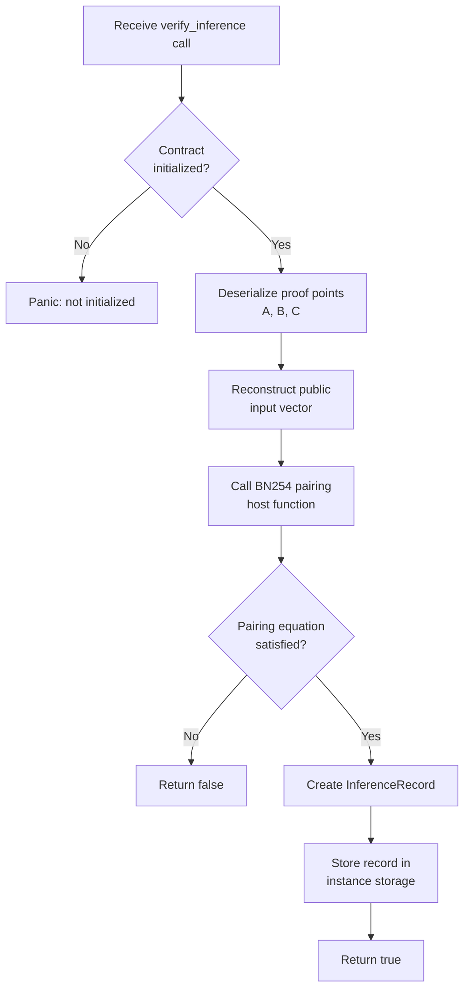
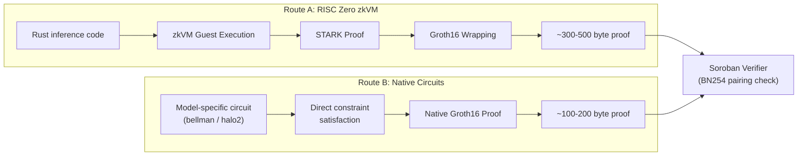
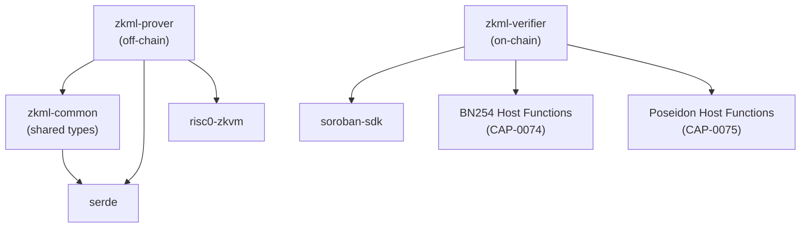
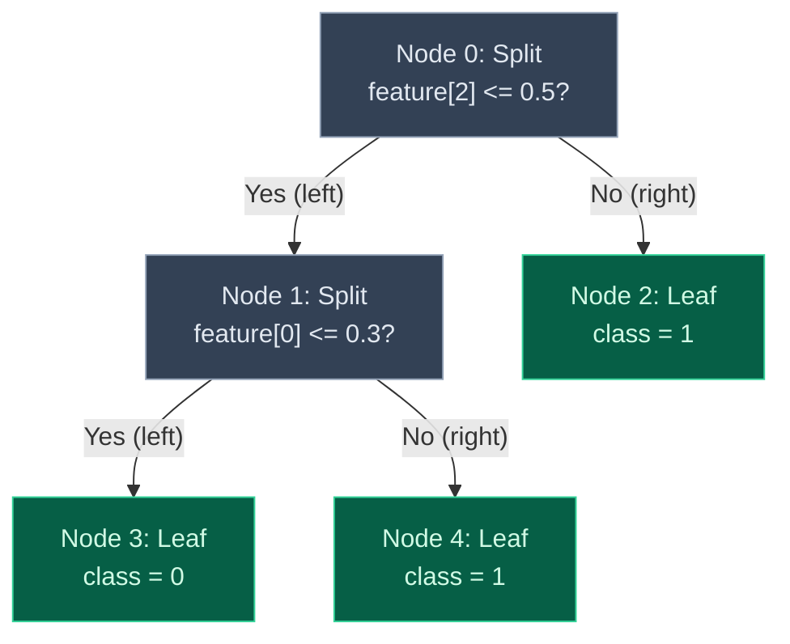

# Technical Diagrams

This document contains visual representations of the zkml-soroban system
architecture, data flows, and component relationships. All diagrams use
Mermaid syntax for version-controlled rendering.

---

## Table of Contents

- [System Architecture](#system-architecture)
- [Proof Generation and Verification Sequence](#proof-generation-and-verification-sequence)
- [Model Import and Quantization Pipeline](#model-import-and-quantization-pipeline)
- [On-Chain Verification Flow](#on-chain-verification-flow)
- [Route A vs Route B Comparison](#route-a-vs-route-b-comparison)
- [Component Dependency Graph](#component-dependency-graph)
- [Decision Tree Circuit Structure](#decision-tree-circuit-structure)

---

## System Architecture

---

## Proof Generation and Verification Sequence

---

## Model Import and Quantization Pipeline

---

## On-Chain Verification Flow

---

## Route A vs Route B Comparison

---

## Component Dependency Graph

---

## Decision Tree Circuit Structure

This diagram illustrates how a simple decision tree is encoded as
arithmetic constraints in a ZK circuit (Route B).

Each split node becomes a comparison constraint in the circuit:
- The prover provides a binary selector `s_i` for each node, indicating the
  traversal direction.
- The circuit enforces `s_i = 1` if `feature[j] <= threshold` and `s_i = 0`
  otherwise.
- A path selector aggregates the binary decisions to identify the reached
  leaf.
- The circuit constrains the output to equal the value of the selected leaf.
