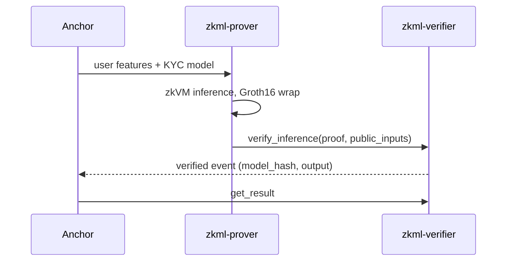

The KYC demo in `examples/kyc-demo/` is the Phase 1 target scenario: train a
decision tree on synthetic KYC data, register it on a testnet verifier, prove a
risk score, and verify it on-chain.

## Status

| Step                                    | Status                                              |
| --------------------------------------- | --------------------------------------------------- |
| Synthetic dataset (`generate_dataset.py`) | Works                                             |
| Training and ONNX export (`train_model.py`) | Works, exports with `target_opset=17`           |
| ONNX import into `zkml-prover`          | Works: a decision tree of 43 nodes over 10 features |
| Model commitment                        | Available via `zkml-prover commit` (JSON models)    |
| Contract build and deployment           | Works with the `stellar` CLI ([guide](/guides/deployment)) |
| On-chain Groth16 verification           | Implemented in the contract                         |
| Groth16 proof generation                | Pending (STARK-to-Groth16 wrap)                     |
| Verification key export                 | Pending                                             |
| Demo runner (`zkml-demo`)               | Skeleton only                                       |

## 1. Generate the dataset

```bash
cd examples/kyc-demo
pip install -r requirements.txt
python generate_dataset.py      # writes kyc_dataset.csv (1000 records)
```

Features: `age`, `account_age_days`, `transaction_count_30d`,
`avg_transaction_amount`, `has_verified_doc`, `jurisdiction_risk_score`,
`login_frequency_30d`, `device_trust_score`, `email_domain_age_days`,
`phone_verified`.

## 2. Train and export

```bash
python train_model.py           # writes kyc_decision_tree.onnx
```

The model is a `DecisionTreeClassifier` with `max_depth=5` and three risk tiers
(0 low, 1 medium, 2 high).

`train_model.py` exports with `target_opset=17`, which is the floor the
importer enforces for the core domain (`MIN_OPSET_CORE`). To check the file
before importing it, run:

```bash
python check_model.py
```

It prints every opset import and every operator in the graph, and exits with a
non-zero status when the core opset is too low. See also the tier mapping
limitation below.

## 3. Deploy the verifier

Follow [Testnet deployment](/guides/deployment).

## 4. Prove and verify (pending)

The intended flow once Groth16 compression lands:



## Mapping risk tiers to the public inputs

For decision trees, `class_label` is always `0` and `output` carries the leaf value
(raw Q16.16). The leaf value equals the risk tier only for JSON trees whose leaves
store the tier (tier 2 is `2 * 65536`). Multi-class ONNX `TreeEnsembleClassifier`
models are not mapped to a tier yet: the extractor keeps one class weight per leaf,
so raising the opset alone does not make the KYC model usable.

## Success criteria

- Proof size under 500 bytes (a Groth16 proof is 256 bytes in the contract encoding)
- End-to-end latency under 60 seconds
- Verified risk tier readable on-chain
